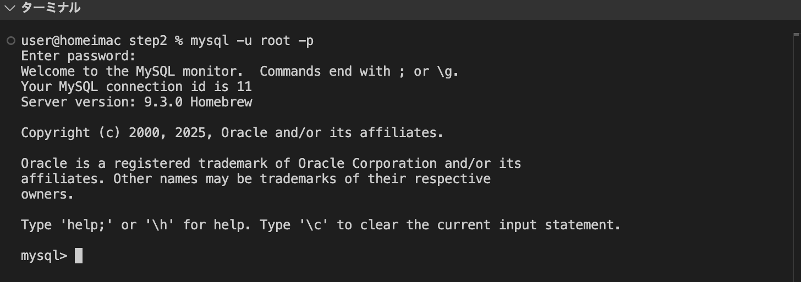

# 0.MYSQL ログイン

※MY SQL はすでにインストール済みであることを想定。

## 1.MYSQL に接続

ターミナルで以下のコマンドを実行し、MYSQL に接続

```
mysql -u root -p
```

## 2.root ユーザのパスワードを入力

パスワード確認画面が表示されるため、root ユーザのパスワードを入力し、MYSQL に接続。

以下の画像のように`mysql>`が表示されたら接続成功。


# データベース構築

## 1.データベース作成

作成するデータベース名は`internet_tv`とする。
以下のように、データベース作成クエリを実行し、`internet_tv`データベースを作成。

```
CREATE DATABASE <データベース名>;
CREATE DATABASE internet_tv;
```

## 2.使用データベースの切り変え

作成したデータベースを使用するためのクエリを実行。

```
USE internet_tv
```

## テーブル作成

テーブル設計表をもとに各テーブルの作成を行います。
mysql で下記のコマンドを実行し、同フォルダ内のテーブル作成用 SQL ファイル(create_tables_query.sql)を実行してください。

`source <実行するファイルのパス>`

_※ファイルパスはフォルダの保存先に応じて適宜変更を行なってください。_

```
SOURCE /Users/user/Desktop/Apprentice_test/internet_tv/step2/create_tables_query.sql
```

# サンプルデータ作成

作成したテーブルにサンプルデータを追加します。

```
SOURCE /Users/user/Desktop/Apprentice_test/internet_tv/step2/insert_sampledata_query.sql
```
